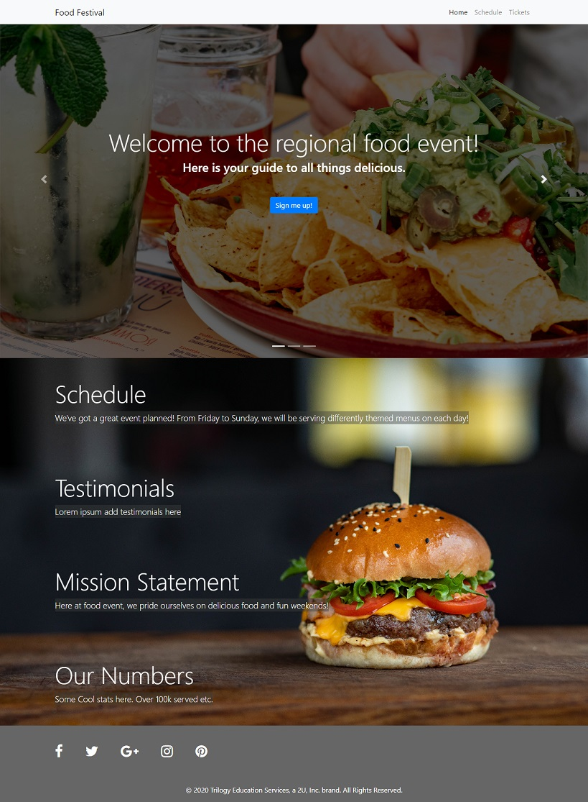

# Food Festival

## Project Description

This project takes a provided application for events and schedules at a food festival and uses various tools to improve performance and to transform the application into a Progressive Web Application (PWA), with offline capability.

## Tools Used
* JavaScript
* Node.js
* webpack (webpack, webpack-cli, webpack-bundle-anaylzer, webpack-dev-server, file-loader, image-webpack-loader, webpack-pwa-manifest)
* browser service worker
* HTML, CSS (bootstrap)
* JQuery

## Installation

If you would like to view the code on your own device, clone the code into a project folder. From the project root directory, type `npm install` to install the necessary packages. Poke around and see how it works!

## Deployed Application

This application is deployed on GitHub pages at: https://kpehl.github.io/food-festival/ 

## Screenshot

## License

  **Licensed under the MIT License.**

 MIT License

Copyright (c) 2020 Week In View

Permission is hereby granted, free of charge, to any person obtaining a copy
of this software and associated documentation files (the "Software"), to deal
in the Software without restriction, including without limitation the rights
to use, copy, modify, merge, publish, distribute, sublicense, and/or sell
copies of the Software, and to permit persons to whom the Software is
furnished to do so, subject to the following conditions:

The above copyright notice and this permission notice shall be included in all
copies or substantial portions of the Software.

THE SOFTWARE IS PROVIDED "AS IS", WITHOUT WARRANTY OF ANY KIND, EXPRESS OR
IMPLIED, INCLUDING BUT NOT LIMITED TO THE WARRANTIES OF MERCHANTABILITY,
FITNESS FOR A PARTICULAR PURPOSE AND NONINFRINGEMENT. IN NO EVENT SHALL THE
AUTHORS OR COPYRIGHT HOLDERS BE LIABLE FOR ANY CLAIM, DAMAGES OR OTHER
LIABILITY, WHETHER IN AN ACTION OF CONTRACT, TORT OR OTHERWISE, ARISING FROM,
OUT OF OR IN CONNECTION WITH THE SOFTWARE OR THE USE OR OTHER DEALINGS IN THE